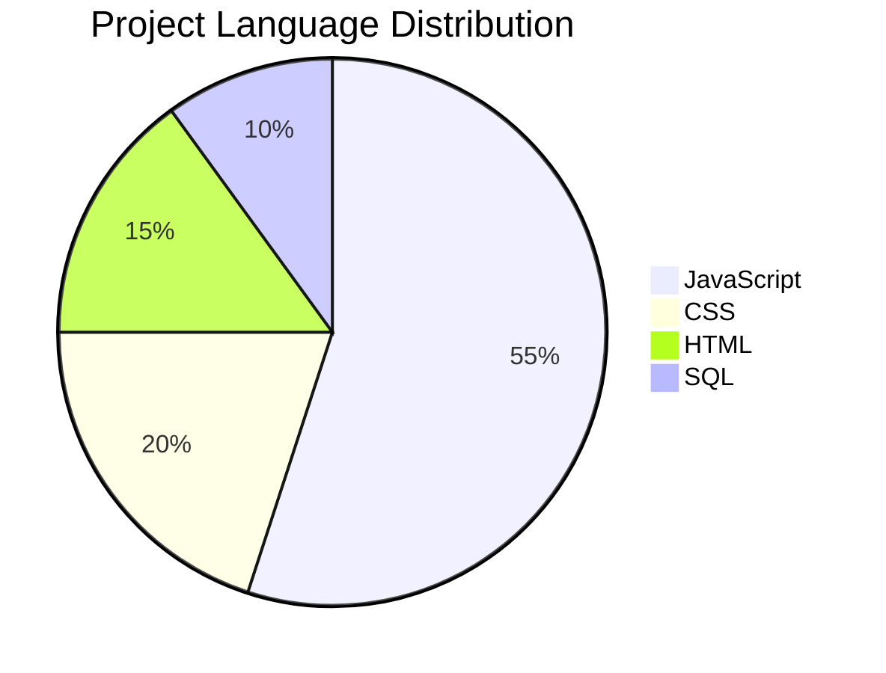

# Human Resource Management System (HRMS)

> A modern Human Resource Management System (HRMS) built for the Odoo Hackathon, designed to streamline employee management, attendance tracking, leave requests, payroll processing, and secure role-based access for organizations.


---

## Overview

The **Human Resource Management System (HRMS)** is a full-stack web application developed for the **Odoo Hackathon**. It provides organizations with a centralized platform to efficiently manage employees, attendance, leave requests, payroll, authentication, and role-based access control.

The system is designed with a responsive React frontend, a scalable Express.js backend, and a MySQL relational database, ensuring reliability, security, and maintainability.

---

## Demo

| Live Demo | Download | Repository |
|-----------|----------|------------|
| [Live Demo](https://your-demo-link.com) | [Download Project](https://your-download-link.com) | [GitHub Repository](https://github.com/your-username/your-repository) |

---

# Features

## Frontend

- Responsive user interface
- Landing page
- Authentication (Login & Registration)
- Employee Dashboard
- Admin/HR Dashboard
- Attendance Management
- Leave Management
- Payroll Management
- Employee Profile Management

---

## Backend

- RESTful API architecture
- Secure Authentication
- Role-Based Access Control
- Input Validation
- Centralized Error Handling
- Modular Express.js Architecture
- Environment Variable Configuration

---

## Database

- MySQL Community Server
- Relational Database Design
- Primary Keys
- Foreign Key Relationships
- Employee Records
- Attendance Records
- Leave Records
- Payroll Records

---

# Tech Stack

| Category | Technologies |
|----------|--------------|
| Frontend | React, React Router, Axios |
| Backend | Node.js, Express.js |
| Database | MySQL Community Server, MySQL Workbench |
| Development | Git, GitHub, Visual Studio Code |

---

# Project Structure

```text
HRMS/
│
├── client/
│   ├── src/
│   ├── public/
│   └── package.json
│
├── server/
│   ├── controllers/
│   ├── routes/
│   ├── middleware/
│   ├── models/
│   ├── config/
│   └── package.json
│
├── database/
│   ├── schema.sql
│   └── seed.sql
│
├── .env.example
├── README.md
└── package.json
```

---

# Installation

<details>
<summary><strong>Prerequisites</strong></summary>

Download and install the following tools before setting up the project.

| Software | Official Download |
|----------|-------------------|
| Node.js | https://nodejs.org |
| Git | https://git-scm.com |
| MySQL Community Server | https://dev.mysql.com/downloads/mysql |
| MySQL Workbench | https://dev.mysql.com/downloads/workbench |
| Visual Studio Code | https://code.visualstudio.com |

</details>

---

# Setup Instructions

## Clone the Repository

```bash
git clone https://github.com/your-username/your-repository.git

cd your-repository
```

---

## Install Frontend

```bash
cd client

npm install

npm run dev
```

---

## Install Backend

```bash
cd server

npm install

npm run dev
```

---

## Database Setup

1. Install **MySQL Community Server**.
2. Open **MySQL Workbench**.
3. Create a new database.
4. Import the provided SQL schema file.
5. Configure the `.env` file with your database credentials.
6. Start both frontend and backend servers.

---

# Environment Variables

Create a `.env` file inside the **server** directory.

```env
PORT=5000

DB_HOST=localhost

DB_USER=root

DB_PASSWORD=your_password

DB_NAME=hrms

JWT_SECRET=your_secret_key
```

---

# Available Scripts

| Command | Description |
|----------|-------------|
| `npm install` | Installs project dependencies |
| `npm run dev` | Starts the development server |
| `npm start` | Starts the production server |
| `npm run build` | Builds the frontend for production |

---

# Future Improvements

- Real-time notifications
- Email integration
- Advanced reporting and analytics
- Progressive Web App (PWA) support
- Performance optimization

---

# Contributors

| Name | Role |
|------|------|
| Dipayan Samanta | Full Stack Developer |
| Gourav Ghosh    | Frontend Developer |
| Rohit Das       | Backend Developer |
| Rashi koiri     | Backend Developer |

---


# Language Distribution


